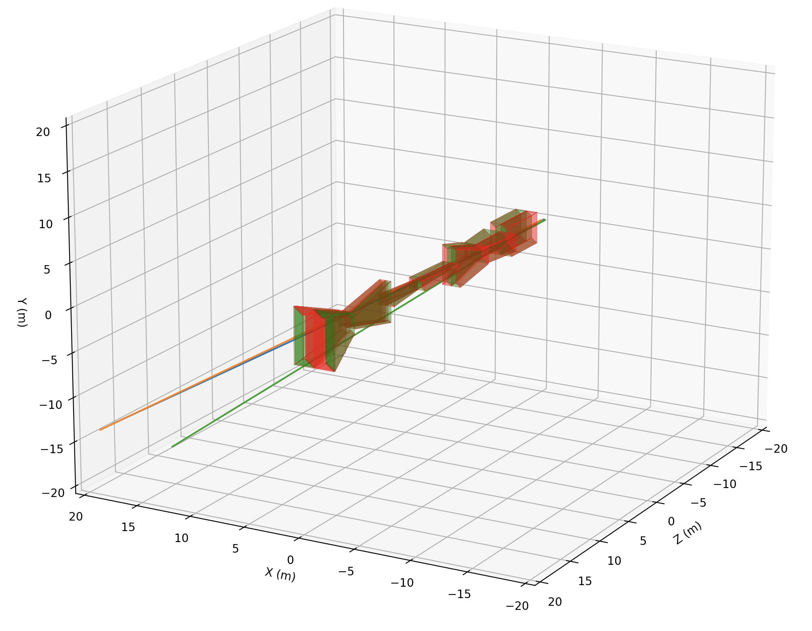

# Muon Shield Optimization for the SHiP experiment (2024 and onward)

Warning: The repository is still in very initial phases of development and can change
really quickly.




## Running
Download simcontainer2.sif from the following location:

[Containers](https://uzh-my.sharepoint.com/:f:/g/personal/shahrukh_qasim_physik_uzh_ch/En9EVDrRsjpIrBnXWGzLQt0BoT65wN2qzBtGbdEJfapBDA?e=b5b776)

If you are using physik cluster, run the singularity container via the following commands:

```
export SINGULARITY_TMPDIR=/disk/users/`whoami`/temp
export TMPDIR=/disk/users/`whoami`/tmp
singularity shell --nv -B /cvmfs -B /disk/users/sqasim -B /run/user/21528 -B /home/hep/sqasim simcontainer.sif
```

For other clusters, modify them accordingly. You should include every directory
you need access to from within the container and then you can 

## Running visually
To be documented